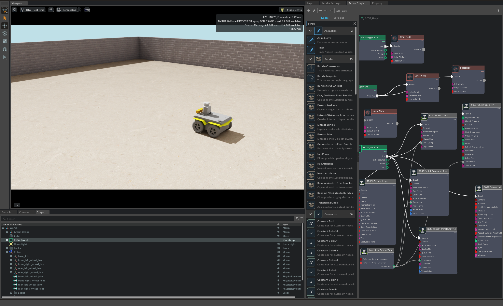
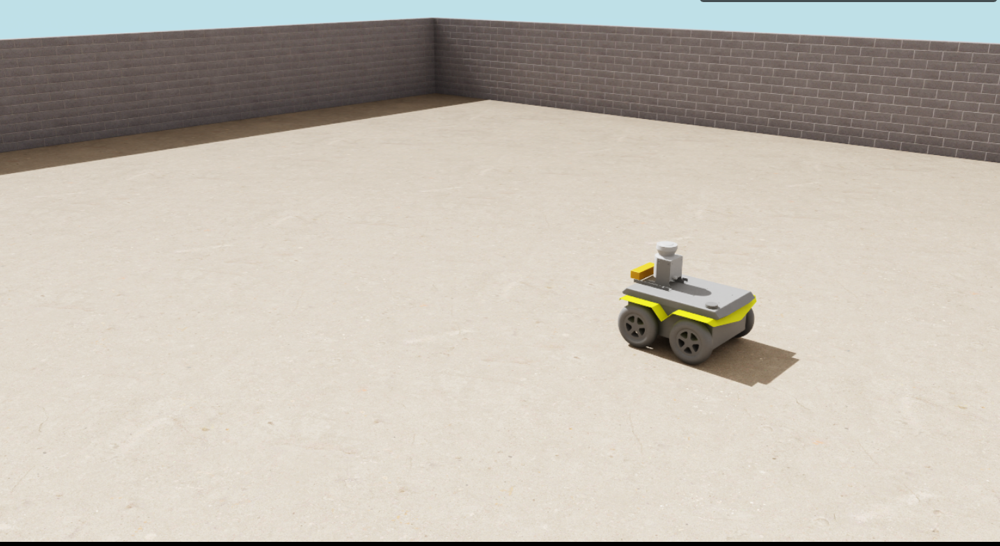
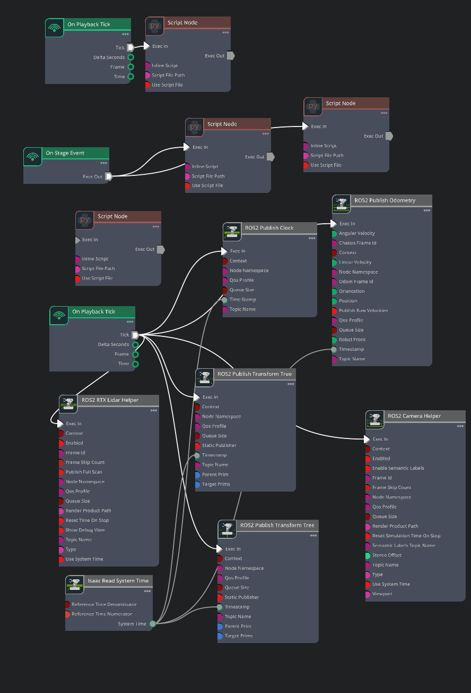
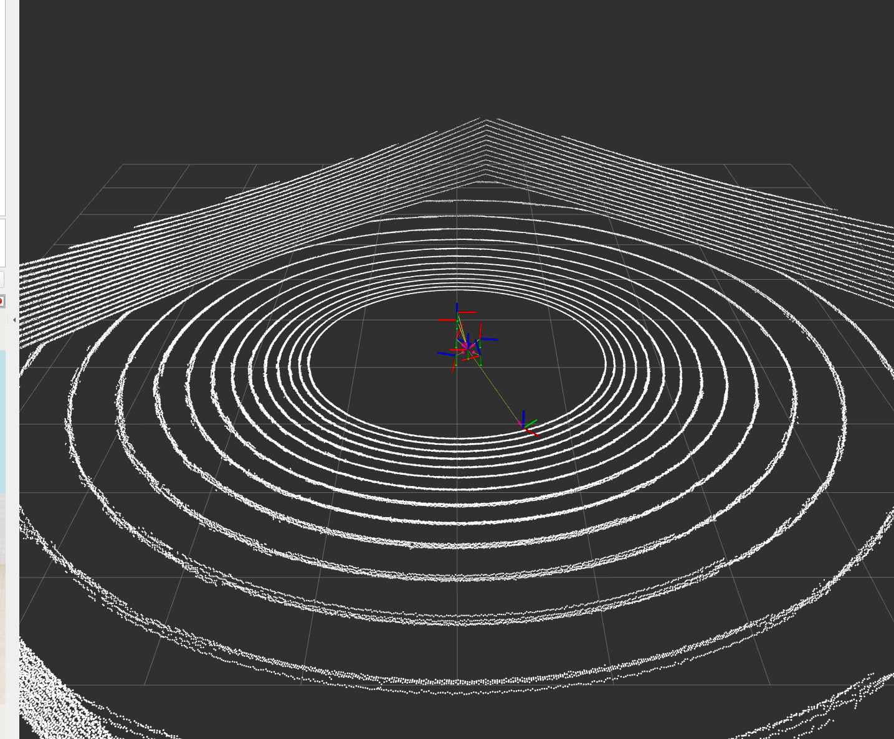
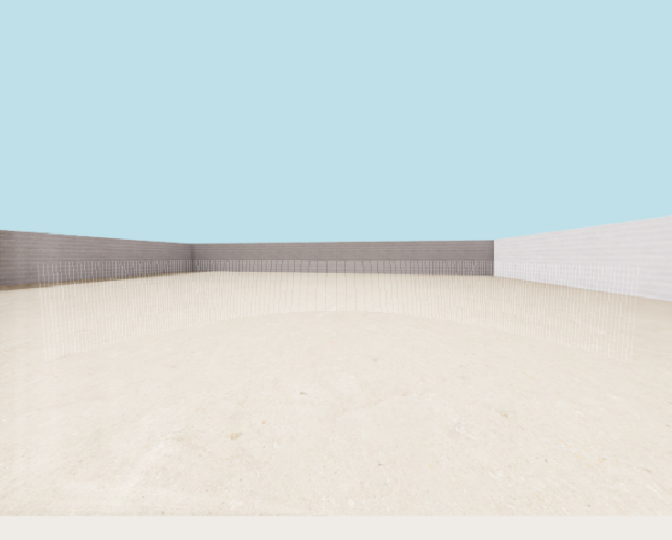
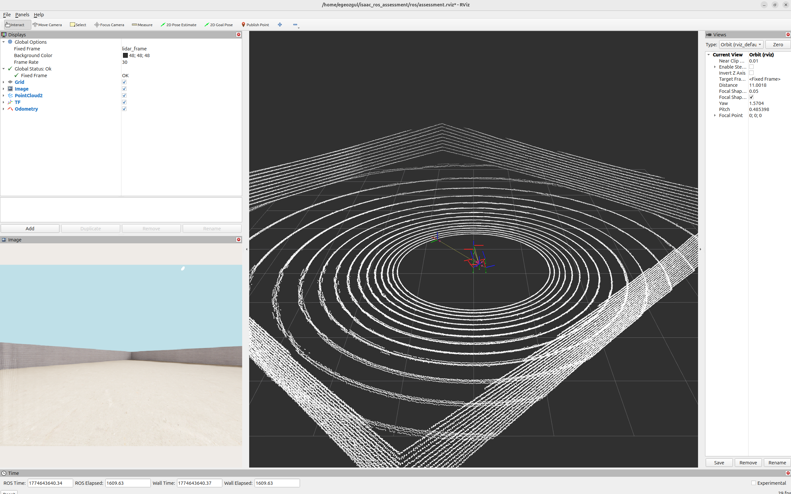

# Isaac Sim + ROS2 Assessment



## Isaac Sim 5.0.0 | Ubuntu 24.04 | ROS2 Jazzy

---

## Architecture
```
Isaac Sim 5.0.0
│
├── Custom USD Scene (assets/custom_scene.usd)
│   ├── Room with walls and 3 objects (Box, Cylinder, Sphere)
│   ├── Robot (4-wheel differential drive)
│   │   ├── base_link (rigid body)
│   │   ├── lidar_frame → RTX LiDAR (Example_Rotary)
│   │   └── camera_frame → Bumblebee Stereo Camera
│   └── DomeLight (randomized intensity)
│
├── Action Graph (ROS2_Graph) - saved in USD scene
│   ├── ROS2 Publish Clock → /clock
│   ├── ROS2 RTX Lidar Helper → /point_cloud
│   ├── ROS2 Camera Helper → /camera
│   ├── ROS2 Publish Odometry → /odom
│   └── ROS2 Publish Transform Tree → /tf
│
└── ROS2 Bridge (isaacsim.ros2.bridge)
        │
        ▼
ROS2 Jazzy Topics
├── /clock
├── /point_cloud  (sensor_msgs/PointCloud2)
├── /camera       (sensor_msgs/Image)
├── /odom         (nav_msgs/Odometry)
├── /tf           (tf2_msgs/TFMessage)
└── /tf_static
        │
        ▼
RViz2 (ros/assessment.rviz)
├── PointCloud2 display → /point_cloud
├── Image display → /camera
├── TF display → /tf
└── Odometry display → /odom
```

---

## TF Tree
```
World
└── base_link
    ├── front_left_wheel_link
    ├── front_right_wheel_link
    ├── rear_left_wheel_link
    ├── rear_right_wheel_link
    ├── lidar_frame
    └── camera_frame
```

---

## Repository Structure
```
isaac_ros_assessment/
├── assets/
│   ├── custom_scene.usd        # Main USD scene with robot, sensors, Action Graph
│   └── isaac_sim_layout.json   # Isaac Sim window layout
├── sim/
│   ├── startup.py              # Run in Isaac Sim Script Editor after Play
│   │                           # Sets up render products + domain randomization
│   ├── robot_controller.py     # Scripted square path controller
│   │                           # Run in Isaac Sim Script Editor to move robot
│   ├── test_topics.py          # Smoke test - verifies all topics publishing
│   └── check_domain_rand.py    # Verifies domain randomization is working
├── ros/
│   ├── assessment.rviz         # RViz config with all displays configured
│   └── static_tf.launch.py    # Static TF publishers for sensor frames
├── docs/
│   └── README.md               # This file
└── Makefile                    # One-command launch scripts
```

---

## Setup & Run

### Prerequisites
- Isaac Sim 5.0.0 (standalone)
- Ubuntu 24.04
- ROS2 Jazzy
- NVIDIA GPU (RTX series recommended)

### One-Command Launch

**Terminal 1 — Launch Isaac Sim:**
```bash
make run_sim
```

**Terminal 2 — Launch RViz:**
```bash
make rviz
```

**Terminal 3 — Move robot:**
```bash
make run_controller
```

**Terminal 4 — Run smoke test:**
```bash
make test
```

### Manual Setup Steps

After launching Isaac Sim:
1. Open scene: **File → Open Recent → custom_scene.usd**
2. Enable ROS2 Bridge extension if not already enabled
3. Hit **Play ▶**
4. Open **Window → Script Editor**
5. Paste contents of `sim/startup.py` and run
6. Open **Window → Script Editor** again
7. Paste contents of `sim/robot_controller.py` and run

---

## Sensor Configuration

### RTX LiDAR (Example_Rotary)
| Parameter | Value |
|-----------|-------|
| Type | NVIDIA Example Rotary |
| Scan Rate | 20 Hz |
| Horizontal FOV | 360° |
| Max Range | 50m |
| Channels | 128 |
| Noise (azimuth std) | 0.01-0.05 rad (randomized) |
| ROS2 Topic | `/point_cloud` |
| Message Type | `sensor_msgs/PointCloud2` |

### Bumblebee Stereo Camera
| Parameter | Value |
|-----------|-------|
| Resolution | 640x480 |
| Frame Rate | ~30 FPS |
| Focal Length | 25mm |
| ROS2 Topic | `/camera` |
| Message Type | `sensor_msgs/Image` |

---

## Domain Randomization

Implemented in `sim/startup.py`, synchronized with simulation frames:

| Parameter | Range | Frequency |
|-----------|-------|-----------|
| Light intensity | 500-3000 lux | Every 300 frames (~5s) |
| LiDAR azimuth noise std | 0.01-0.05 rad | Every 300 frames (~5s) |
| LiDAR elevation noise std | 0.01-0.05 rad | Every 300 frames (~5s) |

---

## Topic Rates

| Topic | Message Type | Rate |
|-------|-------------|------|
| `/clock` | rosgraph_msgs/Clock | 60 Hz |
| `/point_cloud` | sensor_msgs/PointCloud2 | ~9 Hz |
| `/camera` | sensor_msgs/Image | ~30 Hz |
| `/odom` | nav_msgs/Odometry | 60 Hz |
| `/tf` | tf2_msgs/TFMessage | 60 Hz |

---

## Known Limitations & Sim-to-Real Gaps

1. **LiDAR beam visibility**: RTX LiDAR beams are visible in camera feed due to shared ray tracing pipeline. In reality, LiDAR uses infrared wavelengths invisible to RGB cameras.

2. **LiDAR rate**: RTX LiDAR with 128 channels runs at ~9 Hz due to GPU load. Real LiDARs typically run at 10-20 Hz.

3. **TF timestamps**: System time used instead of simulation time to avoid clock sync issues between Isaac Sim and ROS2.

4. **Render products**: Must be recreated each session via `startup.py` due to Isaac Sim 5.0 limitation.

5. **Physics**: Simplified rigid body physics without accurate wheel-ground contact model.

---

## Improvements for Hardware Validation

1. Replace RTX LiDAR with PhysX LiDAR for higher rates
2. Add camera calibration and export intrinsics/extrinsics as YAML
3. Implement proper odometry with wheel encoders
4. Add IMU sensor for better localization
5. Validate sensor data against real hardware measurements
6. Add Nav2 for autonomous navigation


## Bandwidth Measurements
| Topic | Rate | Approx Bandwidth |
|-------|------|-----------------|
| /point_cloud | 9 Hz | ~45 MB/min |
| /camera | 30 Hz | ~1.5 GB/min |
| /odom | 60 Hz | ~1 MB/min |
| /tf | 60 Hz | ~2 MB/min |

Note: Use /camera/compressed to reduce camera bandwidth by ~10x

---

## Screenshots

### Full Isaac Sim Scene


### Viewport View


### Action Graph (ROS2_Graph)


### LiDAR Point Cloud in RViz


### Camera Feed


### Full RViz Visualization


